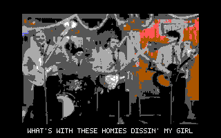
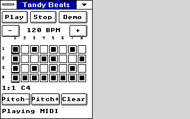

# OEMSound-Tandy

Small Windows 3.0 real-mode instruments and DOS sound/video demos for the
Tandy 1000 EX/HX, using its three square-wave tone voices and one noise voice.
Play MIDI files, try a piano or step sequencer, or watch Buddy Holly with
PSG music and subtitles.

*Six-second silent GIF of the published BUDCAP 0.4 running in DOSBox-X.
Native 320x200 capture, with a 256x160 movie area; no scaling or retouching.
[Capture details](docs/SHOTS/README.MD#budcap-04-animated-preview).*

## Try it

- **Buddy Holly for DOS:** [download BUDCAP04.ZIP](examples/BUDDY/BUDCAP04.ZIP?raw=1)
  and follow the [run instructions below](#buddy-holly-for-dos).
- **Windows 3.x / 16-bit video player:** [WINPLAY.ZIP](examples/BUDDY/WINPLAY.ZIP?raw=1)
  and [instructions](examples/BUDDY/README.TXT) (Windows 3.0 real mode).
- **Tandy Beats Lab:** [runtime package](artifacts/win30/BEATS/MILESTONE.ZIP?raw=1)
  and [guide](artifacts/win30/BEATS/README.MD).
- **PSGPLAY and early sound tests:** [MILESTONE.ZIP](artifacts/win30/MILESTONE.ZIP?raw=1)
  and [package notes](artifacts/win30/README.md).

Mini MIDI, Mini Piano and JOYMIDI have source/build guides linked below;
they are not included in the older milestone packages.
Separate [experimental sound kits](experimental/README.md) add DOS envelopes
and Windows instrument shaping. They are draft emulator-tested alternatives,
not hardware-qualified replacements for the baseline downloads above.

## Buddy Holly for DOS

BUDCAP 0.4 plays the full 241.4-second video at **256x160, 16 colors and
4 fps**, with a score-derived PSG arrangement, 84 subtitle cues and four
short sampled PC-speaker dialogue clips. The song's original recorded vocals
are not played.

Extract [BUDCAP04.ZIP](examples/BUDDY/BUDCAP04.ZIP?raw=1) into a new directory,
keeping the enclosed `BUDCAP` folder intact. Use DOS 3 or later on a Tandy
1000, outside Windows and without sound/PIT TSRs. Change into `BUDCAP` and run:

- `RUN` or `RUNFULL`: full movie, subtitles and short speech clips.
- `RUNTEST`: opening preview, 18-42 seconds.
- `RUNSONG`: song range with subtitles.
- `NOLYRICS`: full movie and speech, without subtitles.

**Escape, Space or Ctrl+C stops; relaunch to restart.** No installer or
AUTOEXEC/CONFIG change is required. For emulation, use DOSBox-X with
`machine=tandy` and `cputype=8086_prefetch`; see the
[run guide](examples/BUDDY/BUDCAP/README.md) for the tested configuration.

The picture intentionally holds during sampled speech, then catches up.
PC-speaker PWM whine remains unresolved, and dialogue caption timing is
approximate. Recorded full emulator runs completed all music states,
captions and speech clips without unexpected video drops or skipped music
events; exact 0.4 playback on physical hardware remains unverified.
[Source and QA](examples/BUDDY/BUDCAP/README.md) ·
[Reproduction](examples/BUDDY/BUDCAP/REPRODUCE.md)

The [earlier players](examples/BUDDY/README.TXT) remain available: the 16-bit
Windows 3.0 real-mode player uses 64x48 video at 4 fps; [DOSPLAY](examples/BUDDY/DOSPLAY.ZIP?raw=1) uses
128x96 at 8 fps with a smaller fallback. They have PSG music but no BUDCAP
subtitles or sampled dialogue.

## Windows instruments

*Actual emulator capture. [Screenshot provenance](docs/SHOTS/README.MD).*

- [Mini MIDI](src/win30/MINIMIDI/README.MD): Play/Stop MIDI-file player for
  type 0/1 files, up to 32 KB and 16 tracks.
- [Mini Piano](src/win30/PIANO/README.MD): mouse and keyboard notes, octave
  controls and Panic; up to three simultaneous tones.
- [JOYMIDI](src/win30/JOYMIDI/README.MD): joystick pitch/velocity instrument
  with explicit arming and Mute/Panic.
- [Beats Lab](artifacts/win30/BEATS/README.MD): four lanes, eight steps,
  40-240 BPM and editable notes; patterns stay in memory.
- [Automatic Mouth](src/win30/MOUTH/README.MD): animated mascot with four
  hand-authored electronic words, not general text-to-speech.
- [PSGPLAY](src/win30/README.MD): a small Play/Stop chord demonstration.

Use an existing working **Windows 3.0 real-mode / 640 KB** Tandy setup or
an isolated emulator guest, following the selected component's guide. Keep
its executable and matching app-local `MIDIMAP.DRV` together where required,
then launch through Program Manager > File > Run. Keep your existing guarded
display launcher and video-memory reservation.

**Do not register app-local MIDIMAP.DRV in SYSTEM.INI or copy it into
WINDOWS\SYSTEM.** Run one PSG producer at a time; close Beats Lab before
another instrument because it keeps its SOUND lease while open.

The baseline mapper provides three melodic voices, velocity-to-volume
mapping, oldest-voice stealing and basic channel-10 noise percussion. It is
not a system-wide MIDI device or General MIDI synthesizer. Program changes,
sustain and pitch bend do not shape the baseline sound. Windows cooperative
timers can delay notes and cleanup. See [supported messages and timing
limits](docs/STATUS.MD), or the separate experimental kit's guide for its
opt-in extensions.

## Other sound tools

[TCHIME](src/win30/CHIME/README.MD), [XPCHIME](src/win30/XPCHIME/README.MD) and
[TEXIT](src/win30/TEXIT/README.MD) provide optional startup/pre-exit phrases.
The companion [Windows XT project](https://github.com/astrobleem/oemdisplay-tandy)
provides the display drivers, desktop shell and integration.

[TSOUND.DRV](src/win30/DRIVER/README.MD) is a separate restricted legacy
Windows SOUND API experiment; use its cloned-guest install/rollback guide.
[PSGTEST](src/psgtest.c) and [WAVHYB](src/wavhyb.c) are earlier DOS tests.
WAVHYB's PCM experiment is not a Windows wave driver.

## Testing and building

Component guides retain emulator tests, audio captures and exact runtime
identities. Mini MIDI and the earlier DOS video player received qualitative
physical-Tandy feedback; this does not qualify every app or newer binary.
DOSBox-X cycle budgets are not calibrated 8088 speed measurements. See
[development status](docs/STATUS.MD) and each component's QA for scope.

Use each component's build guide: the root `BUILD.BAT` does not build all
apps. Windows builds require licensed period Microsoft C and Windows
headers/libraries inside DOSBox-X, with Python 3 wrappers on the host.
[Windows build guide](src/win30/README.MD) ·
[BUDCAP reproduction](examples/BUDDY/BUDCAP/REPRODUCE.md) ·
[Original video conversion](examples/BUDDY/BUILD.TXT)

Hardware reports are welcome: include the machine, RAM, DOS/Windows versions,
exact app/driver hashes, steps and what you heard.

## Licensing and credits

See [LICENSE](LICENSE) (GPLv3) and component-specific notices; this README
does not relicense bundled components or third-party media.
Buddy Holly is by Weezer, written by Rivers Cuomo. The converted video,
score arrangement, captions and sampled dialogue retain separate rights;
the code license grants no rights to the underlying works. See
[attribution and media rights](examples/BUDDY/ATTRIB.TXT).
