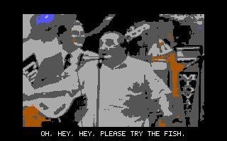
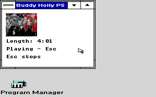

# OEMSound-Tandy

**Native instruments, PSG music and a subtitled music-video demo for the
Tandy 1000.**

Play MIDI files, tap out a tune, sequence eight-step patterns or watch a
four-minute music video on an 8088. This project explores the Tandy's
**three square-wave tone voices and one noise voice**, with small Windows
3.0 real-mode apps and standalone DOS experiments for the original EX/HX.

[Try it](#try-it) · [Buddy Holly / BUDCAP](#buddy-holly--budcap-04) ·
[Expressive previews](#expressive-instrument-previews) ·
[Instruments](#windows-instruments-and-sound-toys) ·
[How MIDI works](#midi-through-the-tandy-psg) ·
[Hardware status](#verification-and-hardware-status) ·
[Windows XT desktop](https://github.com/astrobleem/oemdisplay-tandy)

| Mini Piano · logical 160×200 | Tandy Beats Lab · 320×200×16 |
| --- | --- |
|  |  |

*Actual emulator captures; Mini Piano's columns are doubled by the capture
path. Pictures show the UI, not sound quality or physical timing.
[Screenshot provenance](docs/SHOTS/README.MD).*

## What is here

- **Windows instruments:** Mini MIDI file playback, Mini Piano, joystick
  notes, Beats Lab, PSGPLAY and the Automatic Mouth mascot.
- **App-local MIDI-to-PSG playback:** three melodic voices, velocity mapping,
  voice stealing, basic noise percussion and guarded ownership/cleanup.
- **Public BUDCAP 0.4:** a 256×160, 4 fps DOS video demo with 84 subtitle
  cues, PSG music and four short sampled PC-speaker dialogue clips.
- **Expressive private previews:** BUDENV02 adds a more detailed DOS
  arrangement and short opening cue. The completed WININST 1.2 Windows
  test kit adds original instrument families, envelopes and optional vibrato.
- **Desktop sounds:** optional startup and pre-exit phrases, with integration
  in the companion Windows XT shell.
- **Source and evidence:** component build instructions, scoped native tests,
  audio captures and an experimental Windows 3.0 SOUND driver.

This is experimental software. Available runtime packages and newer
build-from-source previews are listed separately below.

## Try it

| Start with | Available files | Where it runs |
| --- | --- | --- |
| **Current public Buddy Holly demo** | [BUDCAP04.ZIP](examples/BUDDY/BUDCAP04.ZIP) and [source / run guide](examples/BUDDY/BUDCAP/README.md) | Plain DOS, outside Windows |
| **Original Windows video player** | [WINPLAY.ZIP](examples/BUDDY/WINPLAY.ZIP) and [instructions](examples/BUDDY/README.TXT) | Windows 3.0 real mode |
| **Beats Lab** | [Runtime, source and verification](artifacts/win30/BEATS/README.MD) | Windows 3.0 real mode |
| **PSGPLAY and the early sound milestone** | [MILESTONE.ZIP](artifacts/win30/MILESTONE.ZIP) and [package notes](artifacts/win30/README.md) | Windows 3.0 real mode; read the separate driver-test limits |
| **Mini MIDI, Mini Piano, JOYMIDI** | [Mini MIDI source](src/win30/MINIMIDI/README.MD), [Mini Piano source](src/win30/PIANO/README.MD), [JOYMIDI source](src/win30/JOYMIDI/README.MD) | Build required; newer apps are not automatically in the older milestone ZIP |

### Windows app basics

1. Use a backed-up, working **Windows 3.0 real-mode / 640 KB** Tandy setup
   or an isolated emulator guest. Keep your display driver's guarded launcher
   and video-memory reservation.
2. Extract or build the selected app into its own DOS directory. For an
   app-local MIDI instrument, keep its executable and the **matching
   MIDIMAP.DRV together**.
3. Launch through **Program Manager → File → Run**, following the component's
   guide. Sound apps do not install the display driver or desktop shell.
4. Run one PSG producer at a time. **Close Beats Lab before another instrument**;
   it keeps its SOUND lease while open. Use Stop, Escape or Panic as documented.

**Do not register the app-local MIDIMAP.DRV in SYSTEM.INI or copy it into
WINDOWS\SYSTEM.** The separate TSOUND.DRV experiment has its own isolated
test-install and rollback procedure; it is not a general replacement
recommendation.

## Buddy Holly / BUDCAP 0.4

The current public DOS demo plays the **complete 241.4-second video at 256×160,
sixteen colors and 4 fps**, with a score-derived PSG arrangement and
**84 full-video subtitle cues**. Four short original dialogue excerpts add
**10.60 seconds of 6 kHz sampled PC-speaker speech**. The music is synthesized
on the PSG; the song's original recorded vocals are not played.

*The accepted 0.4 in-speech frame, losslessly converted from its retained
BMP evidence. No pixels were redrawn. [Capture source and scope](docs/SHOTS/README.MD#budcap-04).*

### Run the DOS demo

[Download BUDCAP04.ZIP](examples/BUDDY/BUDCAP04.ZIP) and extract into a **new
directory**. Keep the enclosed `BUDCAP` folder intact. Use DOS 3 or later on
a Tandy 1000, fully outside Windows and without sound/PIT TSRs. Change into
`BUDCAP`, then run:

| Command | Playback |
| --- | --- |
| `RUN` or `RUNFULL` | Full movie, subtitles and short speech clips |
| `RUNTEST` | Opening preview, 18–42 seconds |
| `RUNSONG` | Song range with subtitles; no sampled speech in that range |
| `NOLYRICS` | Full movie and speech, with subtitles disabled |

**Escape, Space or Ctrl+C stops.** Relaunch to restart. Running `BUDTALK`
without options also selects full playback with subtitles. There is no
installer or AUTOEXEC/CONFIG edit.

### What improved, and what remains

Version 0.4 adds full-video caption coverage, corrects the two opening
speech excerpts and lets captions advance during speech. The original
256×160 video, PSG score and movie clock remain unchanged from BUDSWEET.

- Both recorded full emulator runs applied **all 1,341 music states, all
  84 captions and all four speech clips**, with no skipped music events or
  unintended video drops.
- The picture **intentionally holds during sampled speech**, for up to
  4.75 seconds, then catches up. Captions can briefly interrupt speech;
  some samples are skipped to stay with the movie clock.
- **PC-speaker PWM whine remains unresolved.** Dialogue subtitle timing is
  approximate, and the closing clips have not had word-exact listening
  confirmation. Any offline EQ listening demo is not a DOS runtime filter.
- Physical EX playback was not newly tested for these exact 0.4 bytes.
  Fixed emulator budgets are not calibrated 8088 speed measurements.

[Source and exact runtime identities](examples/BUDDY/BUDCAP/README.md) ·
[Full-run and stop/error checks](examples/BUDDY/BUDCAP/QA.TXT) ·
[Byte-identical reproduction](examples/BUDDY/BUDCAP/REPRODUCE.md)

### Earlier Windows and DOS players

The [original demo packages](examples/BUDDY/README.TXT) remain available:

| Player | Video | Controls / download |
| --- | --- | --- |
| Windows 3.0 real mode | 64×48, 16 colors, 4 fps | Space: song; Enter: full video; Escape: stop. [WINPLAY.ZIP](examples/BUDDY/WINPLAY.ZIP) |
| Original DOS player | 128×96, 16 colors, 8 fps; 64×48 / 4 fps fallback | Run `DOSPLAY`; `/F` selects full video. [DOSPLAY.ZIP](examples/BUDDY/DOSPLAY.ZIP) |

These older players use PSG music with silent dialogue passages; they do
not include BUDCAP's captions or sampled speech. Keep the Windows player's
five runtime files together, including its app-local MIDIMAP.DRV.

See the original Windows and DOS captures

| Original Windows player | Original DOS player |
| --- | --- |
|  |  |

Retained emulator captures of the older players, not BUDCAP 0.4.
[Build and conversion guide](examples/BUDDY/BUILD.TXT) ·
[Original verification](examples/BUDDY/QA)

The converted frames, score arrangement, captions and sampled dialogue
contain third-party creative work. The project code license does not grant
rights to the underlying song, video, words or recordings. See
[attribution and media rights](examples/BUDDY/ATTRIB.TXT).

## Expressive instrument previews

*Development status, 5 October 2026. These completed private test kits are
not published in this repository or included in the public downloads above.
Physical Tandy acceptance remains open.*

### BUDENV02: expressive Buddy Holly and a short opening cue

The selected DOS preview combines **11 original volume-envelope profiles**
with a phrase-aware arrangement and a short opening-chord approximation.
Lead, bass, rhythm guitar, sustained harmony, guitar responses and noise
percussion have distinct profiles. Section/note-role mappings take effect
at the next note attack without resetting other held voices.

The arrangement restores 15 score-written solo/backing notes, places
source-derived guitar responses in written melody rests, and thins some
generic fifths and hi-hats. Original main-song melody and bass notes,
timing and velocity remain exact. The short opening cue was selected after
listening comparisons; its choral voicing is an approximate three-tone
reduction, and no opening speech samples were added.

Envelopes use the existing **approximately 18.2 Hz BIOS cadence**, with at
most four changed volume-register writes per update. The DOS preview adds
no new timer/IRQ ownership, pitch vibrato or PC-speaker bass. Its video,
84 captions, four speech clips and 241.4-second movie clock are unchanged.

BUDENV02's complete low-budget emulator run and six-second opening test
passed without skipped score states or missed active envelope ticks.
Sampled opening frames matched the control pixel-for-pixel. The underlying
expressive arrangement also passed two full fixed-budget runs and stop/error
checks. Music A/B previews used constant-gain loudness matching only, with
no EQ or denoising. Physical timing and sound remain unverified, and the
original sampled-speech whine remains unresolved.

Public BUDCAP04 is unchanged. The BUDENV source, runtime and listening
previews are not published here yet.

### WININST 1.2: Windows app-local instrument preview

The Windows instrument layer is now **built and emulator-tested as a
private kit**, with updated paired versions of Mini MIDI, Mini Piano,
JOYMIDI and Beats. It preserves the three PSG tone voices plus one noise
voice and leaves the stock system SOUND.DRV unchanged.

- **Eight original melodic families:** Keys, Organ, Bass, Pad, Reed, Lead,
  Bell and Hit, plus kick/snare/hat noise envelopes. These are original
  PSG shapes, not General MIDI instrument replicas.
- **MIDI Program Change:** selects the family per channel; notes already
  sounding keep their preset snapshots. Updated Mini MIDI forwards Program
  Change from files. Piano, JOYMIDI and Beats use the default Keys profile;
  **no preset-selector UI was added**.
- **Opt-in envelopes and vibrato:** updated clients explicitly enable the
  layer and service it from their own Windows task, nominally every 55 ms.
  Vibrato is optional and preset/note-range dependent. There is no new
  driver timer callback, IRQ/PIT hook, extra oscillator or sampled voice.
- **Legacy behavior:** older clients start in rectangular-note mode. The
  unchanged public Beats executable passed with the new mapper. New clients
  require their matching 1.2 mapper; existing controls and ownership rules
  remain. Note Off, all-off, reset and close mute immediately, without tails.

The packaged bytes passed **23 native Windows/DOSBox-X runs** and
**791,501 synthesis host assertions**. Testing covered Program Change,
envelopes, eligible vibrato, legacy clients, controls, ownership, cleanup and
bounded recovery in Windows 3.0 real mode with normal 640 KB memory.

Unloaded synthesis-service intervals measured **55 ms median / 109 ms
95th percentile**. Deliberate heavy redraw and non-yielding stress delayed
service by up to **5.71 seconds**. Recovery skips missed envelope steps
rather than replaying them, but cannot remove the audible pause. This is
cooperative synthesis, not hard real-time playback or a physical 8088
performance guarantee. MIDI pitch bend, sustain and ordinary expression
controllers remain unsupported.

**Public main still contains the earlier MIDIMAP implementation.** The
following linked app guides and MIDI limits describe that published code;
the private 1.2 kit and its full validation report are not public downloads.

## Windows instruments and sound toys

| App | What it does | Useful limits |
| --- | --- | --- |
| [Mini MIDI](src/win30/MINIMIDI/README.MD) | Browse and play Standard MIDI Files type 0/1, with tempo changes, running status, progress and sent/skipped-message counts | Source preview; files up to 32 KB / 16 tracks; no Pause, seek or playlist |
| [Mini Piano](src/win30/PIANO/README.MD) | Mouse press/drag or keys A/W/S/E/D/F/T/G/Y/H/U/J/K; octave controls span C3–C7 | Source preview; three simultaneous square-wave notes; Panic/Escape and focus-loss cleanup |
| [JOYMIDI](src/win30/JOYMIDI/README.MD) | Joystick X chooses pitch, Y chooses next-note velocity; Range, Center, Arm and Mute/Panic | Source preview; single-note instrument, starts muted; physical joystick behavior unverified |
| [Tandy Beats Lab](artifacts/win30/BEATS/README.MD) | Four lanes, eight steps, 40–240 BPM, pitch/rest editing, Demo/Clear and Play/Stop | Patterns stay in memory; cooperative timing can jitter |
| [Automatic Mouth](src/win30/MOUTH/README.MD) | Animated mascot with hand-authored HELLO, TANDY, YES and NO sounds; Speak/Enter and Stop/Escape | Four buzzy electronic words, not general text-to-speech |
| [PSGPLAY](src/win30/README.MD) | Play/Stop test layering C4, E4 and G4, with replay and final mute | Small native sound demonstration |

The existing [milestone files](artifacts/win30/README.md) include recorded
audio, source and test reports. Check the selected component's guide for its
current build and paired runtime files.

## MIDI through the Tandy PSG

In the current public Windows code, Mini MIDI, Mini Piano, JOYMIDI and
Beats call their paired **app-local MIDIMAP.DRV** directly. It provides:

- Three square-wave melodic voices shared across MIDI channels, with
  velocity-to-volume mapping and oldest-voice stealing.
- One basic channel-10 noise/percussion voice.
- Note On/Off, supported all-off messages, exclusive task ownership and
  normal Reset/Close cleanup.

This is a bounded MIDI-message implementation, **not a system-wide MIDI
device, physical MIDI interface or General MIDI synthesizer**. There are
no sampled piano/string patches or Media Player integration. Program
changes, sustain and pitch bend do not shape the sound; unsupported
messages are skipped or rejected by the component's documented contract.

Windows cooperative timers and slow drawing can delay notes or cleanup.
Forced termination and crashes remain outside normal lifecycle coverage.
[Supported notes, messages, timing and ownership limits](docs/STATUS.MD).

## Startup and exit sounds

| App | Phrase |
| --- | --- |
| [TCHIME](src/win30/CHIME/README.MD) | Original short rising phrase, fading to silence and exiting automatically |
| [XPCHIME](src/win30/XPCHIME/README.MD) | Credited three-square-wave arrangement of the XP startup notes, not sampled audio |
| [TEXIT](src/win30/TEXIT/README.MD) | Original descending pre-exit phrase; `/preview` plays without exiting and `/go` supports an already-confirmed caller |

These are optional one-shot apps. Follow their individual tryout and opt-in
startup instructions. The companion
[Tandy Start shell](https://github.com/astrobleem/oemdisplay-tandy/blob/main/examples/TSHELL/README.MD)
offers Tandy/XP/none startup selection and an optional exit sound. Save
prompts and application exit vetoes remain active. Exit returns to DOS;
it does not power off the machine.

## Driver and DOS experiments

- **[TSOUND.DRV](src/win30/DRIVER/README.MD):** a separate, restricted
  Windows 3.0 legacy SOUND API driver with three bounded voice queues,
  notes/rests, timing and articulation controls, threshold events and
  yielding waits. Use only its documented cloned-guest install/rollback
  procedure. Unsupported areas include noise, envelopes, SyncAllVoices
  and a stock system beep.
- **[PSGTEST](src/psgtest.c):** the earlier standalone DOS tone test.
- **[WAVHYB](src/wavhyb.c):** a DOS PCM experiment using PSG volume modulation
  and the PC speaker. It is not a Windows wave driver.
- **[Legacy MIDIMAP scaffold](src/MIDIMAP.C):** retained earlier work;
  current instruments use the separate paired Beats implementation.

## Verification and hardware status

| Area | Evidence and remaining limit |
| --- | --- |
| Mini MIDI | Reported working, with limited sound quality, on a genuine 8088 Tandy 1000 EX / DOS 6.22 / Windows 3.0 real mode. Not calibrated timing or exact-hash acceptance. |
| Mini Piano and JOYMIDI | Component emulator/logic tests are documented; physical keyboard latency and joystick behavior remain unverified. |
| Earlier Buddy Holly players | DOS version received positive physical-Tandy feedback; Windows version was reported to struggle with note timing. Exact hardware frame rates and file hashes were not established. |
| BUDCAP 0.4 | Two full fixed-budget DOSBox-X runs, stop/error checks and byte-identical publication rebuild. Exact 0.4 physical playback and sound quality remain open. |
| BUDENV02 / WININST 1.2 | Completed private emulator-tested previews described above. Public downloads are unchanged; physical acceptance is still open. |
| Legacy SOUND driver | Recorded 105-check isolated native suite and audio captures qualify its tested subset, not complete SOUND compatibility or universal hardware support. |

Recorded Windows tests use real-mode Windows 3.0, normal 640 KB and no
XMS/EMS/UMB workaround. DOSBox-X's `8086_prefetch` and cycle settings are
test configurations, not measurements of a physical 8088. Screenshots,
logged register writes, heard audio and hardware observations are different
kinds of evidence.

[Development status](docs/STATUS.MD) ·
[Mini MIDI tests](src/win30/MINIMIDI/TESTS.MD) ·
[Mini Piano tests](src/win30/PIANO/TESTS.MD) ·
[JOYMIDI tests](src/win30/JOYMIDI/TESTS.MD) ·
[Beats qualification](artifacts/win30/BEATS/VALIDATE.MD)

## Build and contribute

Use each component's guide; the root DOS batch does not build every app.
Windows builds use licensed period Microsoft C/Windows inputs inside
DOSBox-X, orchestrated by Python 3 on the modern host. Python is not a guest
dependency. Use a fresh output directory and inspect the recorded identities.

[Windows build guide](src/win30/README.MD) ·
[BUDCAP reproduction](examples/BUDDY/BUDCAP/REPRODUCE.md) ·
[Original video conversion](examples/BUDDY/BUILD.TXT)

Hardware reports are welcome. Include the machine/RAM, DOS and Windows
versions, app and paired-driver hashes, exact steps, and what you actually
heard. Distinguish hardware from emulation and preserve a working backup.

### Licensing and credits

The repository has a [GPLv3 license](LICENSE) and component-specific notices,
including separately licensed cores. Preserve the notices for the code you
use; historical licensing discrepancies are recorded in
[development status](docs/STATUS.MD). This documentation does not relicense
any component or third-party media.

Buddy Holly is by Weezer, written by Rivers Cuomo. Its music, video and
related media retain their separate rights and attribution; see the
[media notice](examples/BUDDY/ATTRIB.TXT). The companion
[Windows XT project](https://github.com/astrobleem/oemdisplay-tandy) supplies
the display drivers, desktop shell and games shown alongside these apps.
