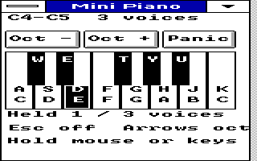
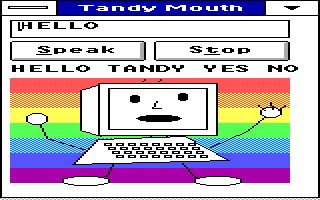
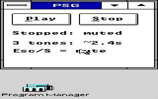

# OEMSound-Tandy

**Mini MIDI, Mini Piano, joystick music, an eight-step sequencer and native
PSG sound toys for Windows 3.0 real mode on the Tandy 1000 EX/HX.**

Turn the Tandy's three square-wave tone voices and noise voice into small
Windows instruments: play notes, sequence beats, try a MIDI file, watch a
talking mascot, or add an optional startup/exit phrase.

[Windows sound milestone](artifacts/win30/README.md) |
[Build guide](src/win30/README.MD) | [Development status](docs/STATUS.MD) |
[Display and Start-menu companion](https://github.com/astrobleem/oemdisplay-tandy)

## Instruments and sound toys

- **[Mini MIDI](src/win30/MINIMIDI/README.MD):** compact MIDI-file player with
  path entry/Browse, Play/restart, Stop/Escape, progress and sent/skipped-message
  counters. Supports Standard MIDI Files type 0/1, tempo changes and running status.
- **[Mini Piano](src/win30/PIANO/README.MD):** play with mouse press/drag or PC
  keys A/W/S/E/D/F/T/G/Y/H/U/J/K; octave buttons/arrows cover C3 through C7.
  Three simultaneous PSG notes, with Panic/Escape and focus-loss cleanup.
- **[JOYMIDI](src/win30/JOYMIDI/README.MD):** joystick-to-note instrument with
  Range, Center, Arm, Mute/Panic, port selection and input display. X selects
  C4..C5 chromatic pitch; Y selects next-note velocity. Button 1 plays, button 2
  disarms. Starts muted and uses session-only calibration.
- **[Tandy Beats Lab](artifacts/win30/BEATS/README.MD):** four lanes and eight
  steps, three melodic voices plus noise percussion, 40–240 BPM, editable
  pitch/rests, Play/Stop, Demo/Clear and keyboard navigation.
- **[Automatic Mouth](src/win30/MOUTH/README.MD):** an original GDI mascot with
  synchronized mouth poses and hand-authored HELLO, TANDY, YES and NO sounds.
  Speak/Enter and Stop/Escape control its buzzy electronic syllables.
- **[PSGPLAY](src/win30/README.MD):** native Play/Stop test layering C4, E4 and
  G4 on the three tone voices, with replay and final mute.

Mini Piano 0.1: thirteen visible keys, octave controls and Panic on a logical
160x200 desktop (the emulator doubles columns in this capture).

Beats Lab playing its compact pattern on the 320x200 sixteen-color desktop.

Automatic Mouth's HELLO frame with the drawn mascot and native controls.
It is a four-word sound experiment, not general text-to-speech.

PSGPLAY after stopping. These are actual emulator captures;
[sources and scope](docs/SHOTS/README.MD) are recorded separately.

## MIDI through the Tandy PSG

Mini MIDI, Mini Piano, JOYMIDI and Beats send MIDI messages directly to their
paired **app-local MIDIMAP.DRV**. The driver provides three melodic square-wave
voices, velocity-to-volume mapping, voice stealing, channel-10 noise percussion,
per-channel all-off and normal Reset/Close cleanup.

**This is not a system MIDI device or a General MIDI synthesizer.** There are
no sampled piano/string patches, external MIDI interface or system-wide Media
Player integration. Unsupported messages such as program changes, sustain and
pitch bend do not shape the sound; Mini MIDI skips them. Windows cooperative
timers can delay playback. [Supported MIDI subset and timing limits](docs/STATUS.MD).

Keep the matching **MIDIMAP.DRV beside each app**. **Do not register it in
SYSTEM.INI or copy it into WINDOWS\SYSTEM.** Close Beats before playing another
instrument; it holds its SOUND lease while open. Run one PSG producer at a time.

## Startup and exit sounds

- **[TCHIME](src/win30/CHIME/README.MD):** an original short rising phrase,
  gentle volume reduction, final mute and automatic exit.
- **[XPCHIME](src/win30/XPCHIME/README.MD):** a credited three-square-wave
  arrangement of the XP startup notes, rather than sampled audio.
- **[TEXIT](src/win30/TEXIT/README.MD):** an original descending pre-exit phrase
  and compact notices. `/preview` plays without exit; `/go` supports a caller
  that already confirmed. Windows save prompts and exit vetoes remain active.

These optional one-shot apps do not require replacing SOUND.DRV. Follow each
app's guide for manual tryout and opt-in startup. The companion
[TSHELL](https://github.com/astrobleem/oemdisplay-tandy/blob/main/examples/TSHELL/README.MD)
offers Tandy/XP/none startup selection and optional exit sound. Exit returns
to DOS; it does not power off the computer.

## Driver and DOS experiments

- **[TSOUND.DRV](src/win30/DRIVER/README.MD):** restricted Windows 3.0 legacy
  SOUND API experiment with three bounded voice queues, notes/rests, duration,
  tempo/articulation/pitch/volume, Start/Stop/Close, counts, threshold events,
  yielding waits and exclusive ownership. Use only the documented isolated
  install/rollback procedure; this is separate from app-local MIDI playback.
- **[PSGTEST](src/psgtest.c):** earlier DOS tone test.
- **[WAVHYB](src/wavhyb.c):** DOS-side unsigned 8-bit mono PCM experiment using
  PSG volume modulation and the PC speaker, not a Windows wave driver.
- **[Legacy MIDIMAP scaffold](src/MIDIMAP.C):** retained earlier driver work;
  current instruments use the separate paired Beats driver.

The SOUND driver has a deliberately limited API. Automatic Mouth does not
promise intelligible speech, Beats patterns stay in memory, Mini MIDI has no
Pause/seek/playlist, and JOYMIDI is a single-note instrument. Full contracts,
test scope and remaining limitations are in [development status](docs/STATUS.MD).

## Run, build and hardware status

Use an existing **Windows 3.0 real-mode / 640 KB** setup on known compatible
Tandy hardware or an isolated Tandy emulator guest. Keep the display driver's
guarded launcher/video-memory reservation. Launch Windows apps through
Program Manager > File > Run; sound apps do not install your display or shell.

First-party milestone files are under [artifacts/win30](artifacts/win30/README.md).
Newer Mini MIDI, Mini Piano and JOYMIDI source previews have their own build
guides under `src/win30`. Builds use the licensed period Microsoft C/Windows
tools inside DOSBox-X, orchestrated by Python 3 on the host.

This is experimental work with emulator evidence and limited hardware reports.
Mini MIDI was reported working, with limited sound quality, on a genuine 8088
Tandy 1000 EX running DOS 6.22 and Windows 3.0 real mode. Mini Piano and physical
joystick/JOYMIDI behavior remain unverified. This does not certify every app,
file or driver on physical hardware.

[Build instructions](src/win30/README.MD) | [Evidence and compatibility limits](docs/STATUS.MD) |
[Screenshot provenance](docs/SHOTS/README.MD)

Contributions and hardware testing are welcome. Include app/driver versions,
environment and reproducible steps. See the existing [LICENSE](LICENSE),
component notices and [licensing status](docs/STATUS.MD).
